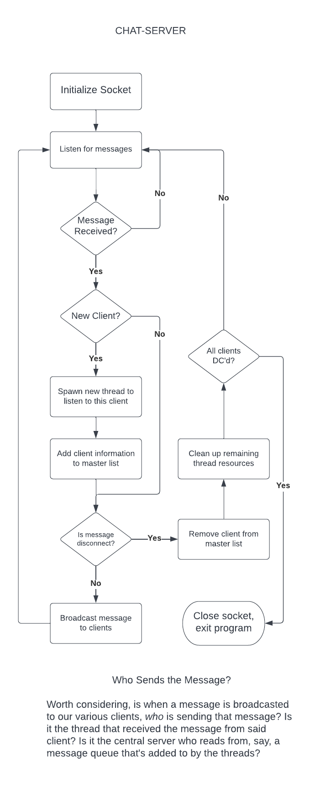

# Can We Talk? - Systems Programming, Assignment 4

## TODO - Mar29, 2022

- [ ] 80-40 char limit messages; how to deal with them?

- [ ] Try and get rid of dynamic memory, server shits itself every so often

## Overall Requirements

- [ ] The *Can We Talk* system is comprised of two applications;

    - The `chat-server`, and

    - the `chat-client`.

- [ ] The above names **must** be reflected in the development structure of the
project.

- [ ] Each application is written in `ANSI C`.

- [ ] Client and server should be *void of all debugging messages* upon submitting.

## The `Chat-Server`

- [ ] The server **must be multithreaded**

    Each time a new user joins the conversation, a new thread is spawned to listen
    for incoming messages from that user.

- [ ] The server broadcasts messages it recieves **to all users**.

    **Design point**: how will the server go about informing all of the clients, managed on separate threads, of a new message? Hence...

- [ ] A master data structure to store all client information should be used.

    **Design point**: this master data structure will be *available to all threads* that are managing incoming messages; how can this safely be achieved?

## The `Chat-Client`

- [ ] The client UI needs to incorporate the ***ncurses*** library.

## Message Format

### Required Information

- [ ] Sending Client's IP address

- [ ] Send Client's username

- [ ] 